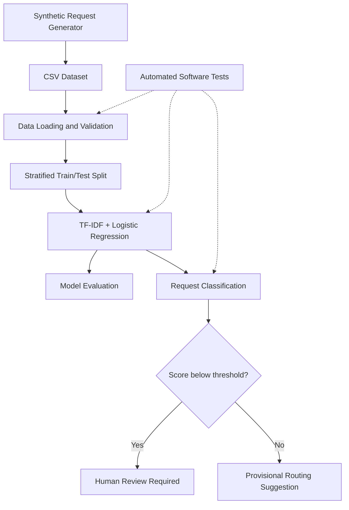
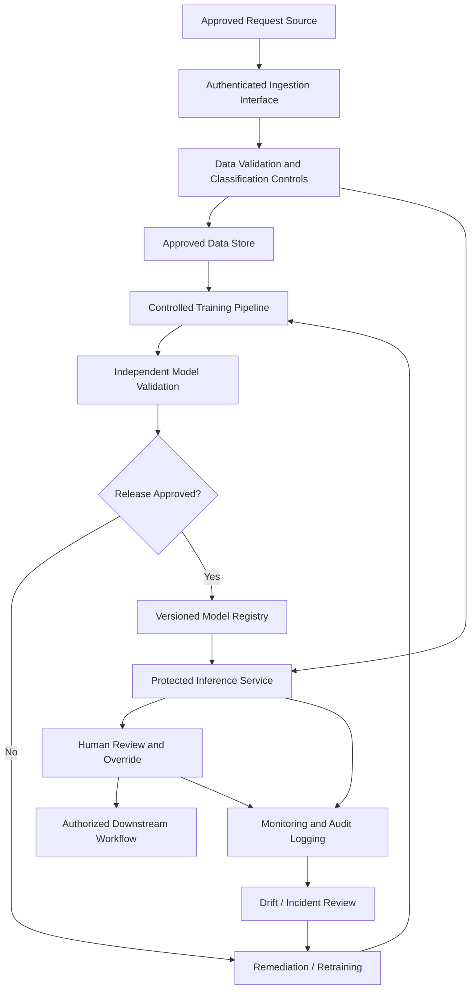

# AI/ML Mission Request Classification - Reference Architecture

## 1. Architecture Overview

**Project:** AI/ML Mission Delivery Demonstration

**System:** Synthetic Mission Request Classification Prototype

**Status:** Educational, non-operational prototype

**Implementation:** Python, pandas, scikit-learn, Google Colab, GitHub

### Objective

Demonstrate the major components of a basic machine-learning
delivery lifecycle and identify the additional engineering,
security, and governance capabilities required before
considering an operational implementation.

The prototype does not process classified information,
does not connect to government systems, and does not
perform automated operational routing.

## 2. Implemented Prototype Architecture

The following diagram represents the educational
workflow implemented in the repository.

The classification results are printed for demonstration.
There is no deployed routing service or live review queue.

## 3. Repository Component Mapping

| Component | Repository Artifact | Function |
|---|---|---|
| Synthetic data generation | `src/generate_data.py` | Produces fictional labeled requests |
| Dataset | `data/synthetic_requests.csv` | Stores synthetic training examples |
| Model experiment | `notebooks/Mission_Request_ML_Experiment.ipynb` | Documents exploratory training and evaluation |
| Standalone training | `src/train_model.py` | Trains and evaluates baseline classifier |
| Prediction logic | `src/predict.py` | Produces advisory category predictions |
| Automated tests | `tests/test_model.py` | Checks selected software behaviors |
| Model governance | `docs/model_card.md` | Documents intended use and limitations |
| Risk management | `docs/risk_register.md` | Documents illustrative delivery and model risks |
| Agile planning | `docs/agile_backlog.md` | Documents illustrative user stories and priorities |

## 4. Data Flow

### Stage 1: Data Generation

A Python script generates fictional mission-support requests.

Each record includes:

- Request identifier
- Program
- Request description
- Category label

The dataset contains 320 records distributed
across four categories.

### Stage 2: Data Preparation

The training script loads the CSV file and
checks for required columns.

Records missing descriptions or category labels
are excluded.

The dataset is divided into training and testing
partitions using stratified sampling.

### Stage 3: Model Training

TF-IDF converts request descriptions into
numerical text features.

Logistic regression learns category associations
from the training records.

The prototype uses a fixed random seed
to support reproducibility.

### Stage 4: Evaluation

The trained model is evaluated using held-out
synthetic test records.

Evaluation outputs include accuracy, precision,
recall, and F1.

The synthetic test results do not establish
operational model performance.

### Stage 5: Inference

The prediction script evaluates new fictional
request descriptions.

It returns:

- Predicted category
- Model score
- Human-review or provisional-routing indicator

The illustrative review threshold is 0.70.

Scores are not calibrated probabilities
of prediction correctness.

### Stage 6: Automated Testing

Pytest checks selected data, prediction,
and threshold behaviors.

The initial test execution produced
eight passing tests.

## 5. Proposed Future-State Architecture

The following diagram represents possible
components of a hypothetical operational system.

**These components are not implemented in this repository.**

## 6. Proposed Security Controls and Boundaries

An operational implementation would need
a formally defined system boundary.

Security considerations include:

- Identity and access management
- Least-privilege access
- Encryption in transit and at rest
- Approved data handling and retention
- Logging and auditability
- Secrets management
- Dependency and software supply-chain security
- Vulnerability management
- Environment separation
- Backup and recovery
- Incident response
- Applicable privacy requirements

The selection and implementation of controls
would depend on the actual system context,
impact categorization, and authorization requirements.

No security controls listed here should be
interpreted as already implemented or assessed.

## 7. Proposed DevSecOps and MLOps Capabilities

Potential future enhancements include:

- Automated code testing on each pull request
- Dependency vulnerability scanning
- Versioned datasets and model artifacts
- Reproducible training pipelines
- Independent model validation gates
- Model performance monitoring
- Drift detection and retraining triggers
- Deployment rollback procedures
- Controlled release approvals
- Audit evidence collection

These capabilities would be planned,
prioritized, and verified before operational use.

## 8. Technical Program Management Considerations

A Technical Project Manager would coordinate:

1. Mission requirements and acceptance criteria
2. Data availability and governance dependencies
3. Model development and evaluation milestones
4. Interface and integration requirements
5. Test strategy and release readiness
6. Security and authorization planning
7. Cross-team risks and dependencies
8. Stakeholder demonstrations and feedback
9. Deployment, operations, and sustainment planning

## 9. Architecture Decision Records

### ADR-001: Use Synthetic Data

**Decision:** Use only generated fictional requests.

**Rationale:** Enable public experimentation without
introducing sensitive operational information.

**Tradeoff:** Results cannot establish real-world performance.

### ADR-002: Use a Simple Baseline Classifier

**Decision:** Use TF-IDF and logistic regression.

**Rationale:** Provide an understandable, reproducible
baseline suitable for an educational demonstration.

**Tradeoff:** Limited ability to handle complex semantics.

### ADR-003: Require Advisory Outputs

**Decision:** Treat all model predictions as advisory.

**Rationale:** Avoid presenting model output as
an authorized operational decision.

**Tradeoff:** Human review may increase processing time.

### ADR-004: Separate Training and Prediction Code

**Decision:** Maintain standalone training and
prediction scripts.

**Rationale:** Improve code organization, testing,
and reproducibility.

**Tradeoff:** The current prediction script retrains
the model when executed rather than loading a
persisted, approved model artifact.

## 10. Architecture Limitations

The current prototype does not include:

- A production API
- A deployed user interface
- A model registry
- A persistent model artifact
- An operational human-review queue
- Monitoring infrastructure
- A cloud deployment
- Security accreditation
- An Authority to Operate (ATO)

## 11. Conclusion

This reference architecture demonstrates the
components of a small educational ML workflow
and outlines additional capabilities that would
be necessary for an operational AI/ML program.

It is a learning and technical program management
artifact, not an approved government system design.
